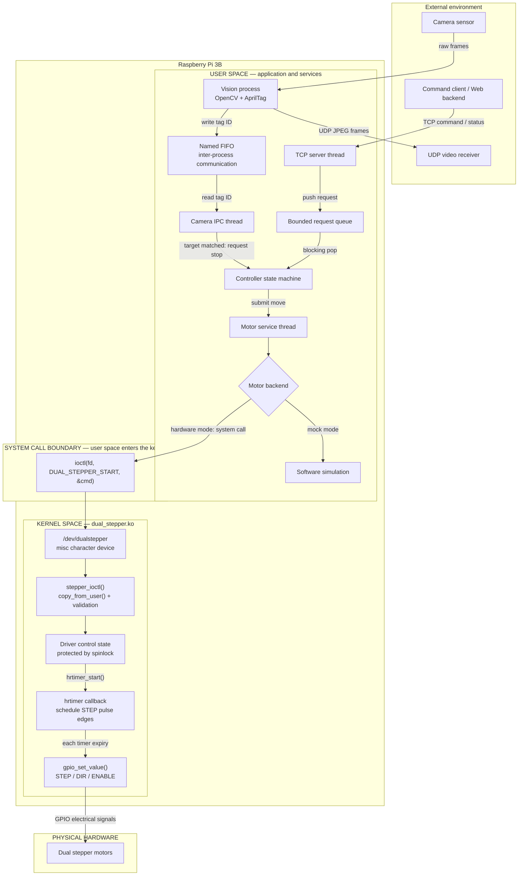

# Wall-Climbing Delivery Robot Controller

A Raspberry Pi 3B course project that connects a Linux character driver,
multi-threaded user-space control, TCP commands, and camera-assisted floor
detection for a wall-climbing delivery robot.

The project is presented as an **embedded Linux and operating-system concepts
prototype**, not as a production or hard real-time controller. The current
revision focuses on clear module boundaries, safe concurrency, and a
hardware-free demonstration path.

## What this project demonstrates

- A Linux miscellaneous character driver controlling two stepper motors through
  a shared `ioctl` API.
- High-resolution timer callbacks and spinlock-protected state in kernel space.
- A bounded producer-consumer request queue using a mutex and condition variable.
- A dedicated motor worker with optional `SCHED_FIFO` scheduling and CPU affinity.
- A `poll`-based TCP server that can keep multiple command clients connected.
- Process-to-process communication between the C++ vision process and the C
  controller through a named FIFO.
- An interchangeable mock motor backend for demonstrations without Raspberry Pi
  hardware.

## Current architecture



The named FIFO is a Linux IPC object used by two user-space processes. It is not
part of the kernel driver. See [docs/architecture.md](docs/architecture.md) for
the responsibility and thread model. The original course diagram is retained at
[docs/original-architecture.png](docs/original-architecture.png) as historical
project material.

## Controller states

```text
IDLE -> PROCESSING -> MOVING -> ARRIVED
                         |         |
                         +-> STOPPED/FAULT
```

During a move, detecting the AprilTag that matches the target floor requests an
early motor stop and confirms arrival. In mock mode, completion is generated by
the simulated motion duration, so the basic path can run without a camera.

## Repository layout

```text
app/
  controller/       C controller, TCP, queue, motor service, and camera IPC
  vision/           C++ OpenCV/AprilTag process
driver/              Linux dual-stepper kernel module
include/             Shared kernel/user-space ioctl UAPI
tools/               TCP command client and direct motor CLI
scripts/             System launcher
docs/                Architecture notes and original course assets
build/legacy/         Preserved kernel module built for the original environment
Makefile              User-space and kernel build entry points
```

## Hardware-free demo

Requirements: Linux, GCC/G++, GNU Make, and POSIX threads. OpenCV is not required
for the controller-only demo.

```bash
make
./scripts/start_system.sh --mock
```

In another terminal, submit a request:

```bash
./build/command_client 127.0.0.1 3 DELIVER
```

Expected state sequence:

```text
PROCESSING -> MOVING -> ARRIVED
```

The controller accepts one JSON object per line. Examples:

```json
{"CMD":"DELIVER","FLOOR":3,"ID":"DEMO-001","LOCKER":"A"}
{"CMD":"STATUS"}
```

To simulate camera feedback while a request is moving:

```bash
printf '3\n' > /tmp/wall_robot_apriltag.fifo
```

## Raspberry Pi build and run

The hardware path requires Raspberry Pi Linux kernel headers that match the
running kernel. GPIO numbers and motor calibration remain board-specific.

```bash
make app tools
make driver
sudo insmod driver/dual_stepper.ko
sudo ./build/wall_robot_controller
```

Build the optional vision process with OpenCV 4 and its ArUco module:

```bash
make vision
./build/camera_app --server 192.168.1.10 --port 8889
```

The old binary in `build/legacy/` is preserved for reference only. Kernel modules
are tied to the kernel build they were compiled against and should normally be
rebuilt rather than reused.

## Design notes and limitations

- `SCHED_FIFO` and CPU affinity are best-effort latency controls here. This
  project does not include PREEMPT_RT or latency/jitter measurements and does not
  claim hard real-time behavior.
- The POSIX signal shutdown path uses a `sigwait` thread. It deliberately avoids
  calling `printf`, `ioctl`, or pthread synchronization from a signal handler.
- The TCP protocol uses a small purpose-built command parser, not a complete JSON
  implementation. Authentication, TLS, persistent order storage, and reconnect
  recovery are outside the course-project scope.
- The driver uses Raspberry Pi GPIO numbers and the legacy integer GPIO API. A
  production revision should describe pins in Device Tree and evaluate GPIO
  descriptors plus a PWM/DMA-based pulse generator.
- There is no encoder feedback. Hardware-mode completion is estimated from the
  configured step frequency; AprilTag detection provides an independent stop
  cue but is not a safety-rated sensor.
- UDP video sends one compressed JPEG per datagram and is intended only as a
  lightweight prototype transport.
- The physical mechanism is no longer available, so post-course refactoring must
  be validated in mock mode and code review unless equivalent hardware is built.

## Project perspective

This was an early exercise in connecting Linux user space and kernel space:
threads coordinate network, motion, and camera events while a character driver
owns timing-sensitive GPIO output. Its limitations motivated deeper follow-up
work with explicitly owned tasks, peripheral drivers, and an RTOS on STM32.

## License note

The kernel module declares `GPL-2.0-only`. Licensing for the remaining historical
course material should be clarified with all team contributors before public
redistribution.
