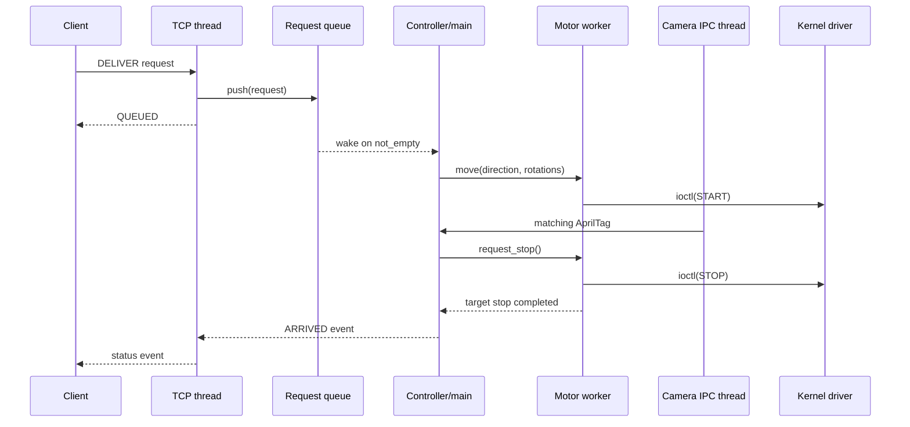

# Software architecture

## Responsibility boundaries

| Component | Context | Responsibility |
|---|---|---|
| TCP server | User-space thread | Maintain client sockets, frame commands, enqueue requests, publish status |
| Request queue | User-space shared object | Bound and synchronize producer/consumer traffic |
| Controller | Main user-space thread | Own floor state and execute the request state machine |
| Camera IPC | User-space thread | Decode newline-delimited AprilTag IDs from the FIFO |
| Vision app | Separate user-space process | Capture frames, detect tags, and send preview frames |
| Motor service | User-space worker thread | Serialize moves, apply the velocity profile, and handle stop requests |
| Motor backend | User-space adapter | Select a mock implementation or translate commands to `ioctl` |
| Dual-stepper driver | Kernel module | Validate commands and generate synchronized STEP edges with `hrtimer` |

## Concurrency model

All controller state is protected by the controller mutex. Queue state and motor
worker state have separate locks, so TCP and camera threads do not directly
modify motion commands. Shutdown signals are blocked process-wide and consumed
by a dedicated `sigwait` thread, which closes the request queue and wakes blocked
workers through their normal synchronization paths.

## Kernel boundary

`include/dual_stepper_uapi.h` is the single source of truth for command layout and
ioctl numbers. Fixed-width Linux types keep the ABI stable between the 64-bit
user process and kernel module. The interface currently supports:

- `DUAL_STEPPER_START`
- `DUAL_STEPPER_PAUSE`
- `DUAL_STEPPER_RESUME`
- `DUAL_STEPPER_STOP`

The driver owns GPIO state and timer callbacks. Policy such as floors, motion
profiles, network commands, and AprilTag interpretation remains in user space.
